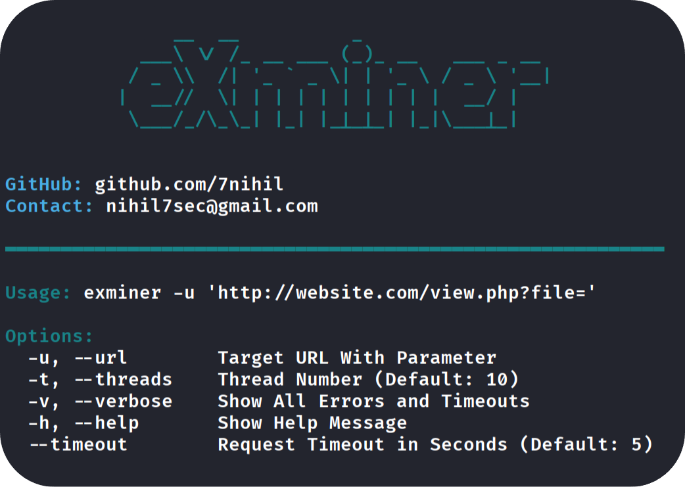
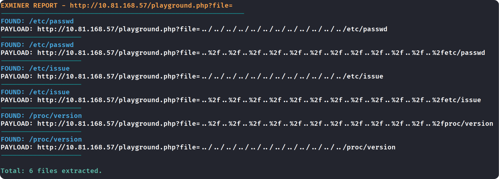

<h1 align="center">
  eXminer | Path Traversal & LFI Scanner Tool
</h1>

<p align="center">
  
</p>

> [!WARNING]
> **eXminer was developed for ethical penetration testing and educational purposes. It should only be used within legal frameworks. Users are responsible for any unethical use.**

<h1>-> Features <-</h1>

* **False-Positive Logic:** Automatically filters out empty results such as SQL syntax errors, PHP warnings, and "file not found" messages to ensure 100% valid findings.
  
* **Signature-Based Verification:** Uses Regex patterns to verify critical system files (e.g., `/etc/passwd`, `/proc/version`, `win.ini`) by searching for unique content signatures.
  
* **Multi-Encoding:** Implements various traversal techniques including standard `../`, URL encoding (`%2f`), and double encoding (`%252f`) to bypass WAFs and basic filters.

* **High-Concurrency Scanning:** Powered by `ThreadPoolExecutor` for high-speed automated discovery without compromising server stability.
  
* **Automated Evidence Logging:** Generates a structured 'exminer_results.txt' report. It logs every successful exploit with the exact payload, providing a ready report for the operator.
  
<h1>-> Installation <-</h1>

- Open the terminal and execute the following commands to clone the repository and install dependencies:

```bash
> git clone [https://github.com/7nihil/exminer.git](https://github.com/7nihil/exminer.git)

> cd exminer

> pip install -r requirements.txt
```

1. Option | Execute with Python ;
```bash
> python3 exminer.py -u "http://target.com/view.php?file="
```
2. Option | Execute with /usr/local/bin ;
 ```bash
> sudo cp exminer.py /usr/local/bin/exminer && sudo chmod +x /usr/local/bin/exminer

> exminer -u "http://target.com/view.php?file="
```


- Result TXT File Example ;

<p align="center">
  
</p>

- Contact ;
```bash
> nihil7sec@gmail.com
```
